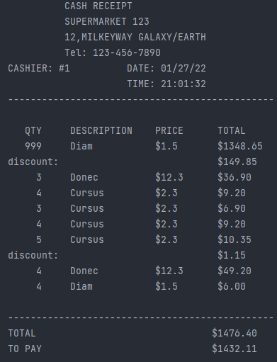
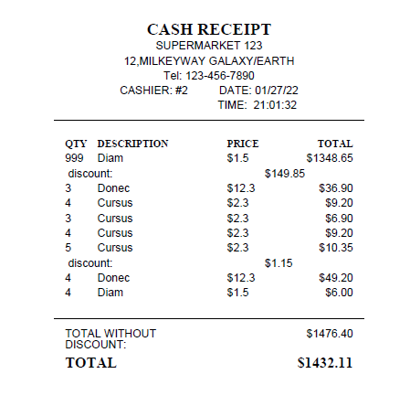

# Clevertec Test Exercise 

## Startup instructions

To run the application, we will need the Maven and Apache Tomcat.

### Startup console application

Open console in root directory of project and enter this commands

To read data from `csv` files
```
mvn clean package assembly:single
java -jar .\target\ClevertecTestEx-1.0-SNAPSHOT-jar-with-dependencies.jar 1-1 0-3 2-5 card-1 products.csv cards.csv
```

To read data from code
```
mvn clean package assembly:single
java -jar .\target\ClevertecTestEx-1.0-SNAPSHOT-jar-with-dependencies.jar 1-999 0-3 2-4 2-3 2-4 2-5 0-4 1-4 card-2
```

### Startup web application 
To startup web application we need move files: `config.propeties`, `cards.csv`, `products.csv`
to tomcat bin directory (Example: apache-tomcat-9.0.54\bin\).

After that move directory `ClevertecTestEx-1.0-SNAPSHOT` to tomcat webapps
(Example: apache-tomcat-9.0.54\webapps\ )

Open console in apache-tomcat-9.0.54\webapps\bin and start server

```
./catalina.bat start
```

in browser enter url 

`http://localhost:8080/ClevertecTestEx-1.0-SNAPSHOT/bill?args=1-92 0-3 2-4 2-3 2-4 2-5 0-4 1-4 card-1`
— data from code

`http://localhost:8080/ClevertecTestEx-1.0-SNAPSHOT/bill?args=1-1 0-3 2-5%20card-1 products.csv cards.csv`
— data from files


P.S. If you want to create `.war` by yourself.
You need to change path in code:

src.main.java.service.impl.BillToPdfImpl 
```
 // to war change to ../webapps/ClevertecTestEx-1.0-SNAPSHOT/bill.pdf
 PdfWriter.getInstance(document, new FileOutputStream("bill.pdf"));
```

##Example of bill:
In console:

 

In pdf


